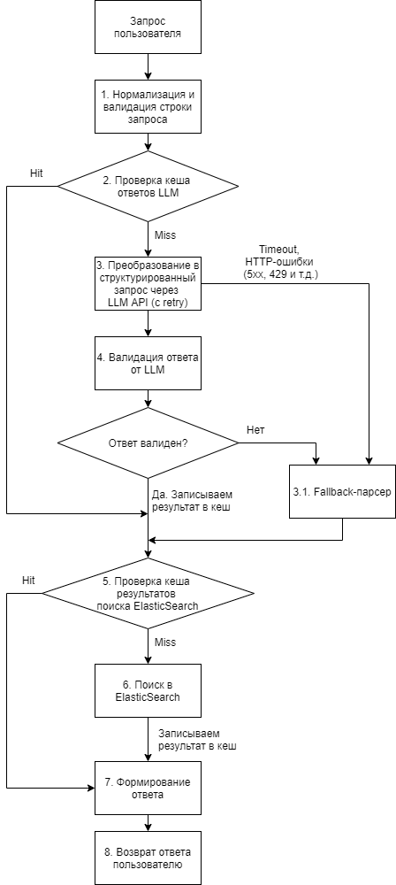

# Задание 1. Проектирование поискового конвейера

## Контекст

Есть веб-сервис для поиска по базе научных публикаций и патентов (более 5 миллионов документов). Пользователь вводит поисковый запрос на естественном
языке, например: «патенты по литий-ионным аккумуляторам для электромобилей
за последние 5 лет». Система должна преобразовать этот запрос в структурированный поисковый запрос, выполнить поиск и вернуть ранжированные результаты.

## Дано

- Полнотекстовый поисковый движок (аналог Elasticsearch/OpenSearch) с индексом
  документов.

- Внешний сервис LLM (API), который может преобразовать текстовый запрос в
  структурированный JSON (с фильтрами, ключевыми словами, диапазонами дат).

- LLM иногда отвечает медленно (до 10 секунд), иногда возвращает ошибки, иногда
  — некорректный JSON.

- Требуется SLA по ответу пользователю: не более 15 секунд на весь путь.

## Что нужно сделать

- Спроектировать последовательность шагов обработки запроса (конвейер) от
  получения запроса пользователя до выдачи результатов. Описать каждый шаг: что
  делает, какие данные принимает и отдаёт.

- Предложить стратегию обработки ошибок LLM: что делать, если LLM вернул
  невалидный JSON? Если превышен таймаут? Если вернулась пустая структура?

- Предложить механизм кеширования: какие запросы имеет смысл кешировать, по
  какому ключу, с каким временем жизни и почему.

- Описать, как обеспечить SLA в 15 секунд при нестабильном LLM. Предложить
  резервный план (что вернуть пользователю, если LLM недоступен).

## Формат ответа

Схема конвейера (текстовое описание или диаграмма) + обоснование ключевых решений.
Псевдокод или реальный код для наиболее сложных участков (обработка ошибок,
кеширование).

## Схема конвейера

### Шаг 1. Нормализация и валидация запроса

**Входные данные.** Сырая строка запроса пользователя.

**Выходные данные.** Нормализованная строка.

**Действия.** Очистка входного текста: удаление лишних пробелов, спецсимволов и потенциальных инъекций, ограничение длины (например, максимум 500 символов).

### Шаг 2. Проверка кеша результатов ответа LLM

**Входные данные.** Нормализованная строка.

**Выходные данные.** Cache hit -> структурированный JSON, Cache miss -> null.

**Действия.** Вычисление ключа кеша (нормализованная строка -> lowercase + стемминг или лематизация -> SHA-256), проверка наличия готового структурированного запроса в Redis/Memcached. При попадании переход сразу к шагу поиска в Elasticsearch.

### Шаг 3. Преобразование в структурированный запрос через LLM API

**Входные данные.** Нормализованная строка + системный промпт с JSON-схемой.

**Выходные данные.** JSON {keywords, filters, date_range} или ошибка.

**Действия.** Отправка запроса к LLM API с системным промптом, который определяет JSON-схему ответа, с таймаутом 10 сек. При таймауте - немедленный переход к fallback-парсеру. При 5xx ошибке и быстром ответе, если позволяет время, то делаем короткий retry с таймаутом 3 сек. При 429 ошибке сразу переходим к fallback-парсеру.

### Шаг 3.1. Fallback-парсер

**Входные данные.** Нормализованная строка.

**Выходные данные.** Структурированный JSON с той же схемой (с теми данными, которые удалось распарсить из строки запроса).

**Действия.** Попытка извлечь данные для поиска из нормализованной строки на основе регулярных выражений и словарей. Например, диапазон дат ("за последние 5 лет"), тип документа ("патент"), ключевые слова. Формирование структурированного JSON на основе извлеченных данных. Сформированный JSON не кешируется, так как его качество ниже ответа от LLM.

### Шаг 4. Валидация ответа от LLM

**Входные данные.** Сырой ответ от LLM.

**Выходные данные.** Валидный структурированный JSON или переход к fallback-парсеру.

**Действия**. Если ответ от LLM не является валидным JSON, то пытаемся его исправить (удалить markdown разметку, исправить тип кавычек, убрать лишние завершающие запятые). После этого снова валидируем JSON и в случае ошибки переходим к fallback-парсеру.

Далее проверяем JSON по JSON-схеме: наличие обязательных полей, типы значений, нахождение типа документа в справочнике типов и т.д. 

Если JSON невалиден, пытаемся привести его к валидному состоянию (приведение типов, автозаполнение обязательных полей значениями по умолчанию и т.д.). 

Если после этого JSON все равно невалиден, то переходим к fallback-парсеру.

В случае успешной валидации - запись JSON в кеш.

### Шаг 5. Проверка кеша результатов поиска Elasticsearch

**Входные данные.** Структурированный JSON-запрос.

**Выходные данные.** Cache hit -> ранжированный массив документов, Cache miss -> null.

**Действия.** Вычисление ключа кеша (структурированный JSON + параметры пагинации -> SHA-256), проверка наличия результатов поиска по ключу в кеше. При попадании переход сразу к шагу формирования результата и возврата его клиенту.

### Шаг 6. Поиск в Elasticsearch

**Входные данные.** Структурированный JSON-запрос.

**Выходные данные.** Ранжированный массив документов.

**Действия.** Преобразование структурированного JSON в Query DSL для Elasticsearch и поиск в нем. Возврат ранжированного массива документов с учетом пагинации с предварительным добавлением его в кеш.

### Шаг 7. Формирование ответа

**Входные данные.** Результат от Elasticsearch.

**Выходные данные.** Массив документов с метаданными.

**Действия.** Добавление к массиву документов метаданных (например, данные пагинации, флаг использования fallback-парсера и т.д.).

### Шаг 8. Возврат ответа пользователю

**Входные данные.** Массив документов с метаданными.

**Выходные данные.** HTTP JSON response.

**Действия.** Сериализация массива документов с метаданными, возврат ответа пользователю.

[Примерный код оркестратора конвейера](SearchPipelineOrchestrator.php)

## Стратегия обработки ошибок.

1. **Превышен таймаут запроса к LLM.**
   
   Отмена запроса к LLM, переход к fallback-парсеру.

2. **Ошибка HTTP 5xx.**
   
   В случае, если LLM вернула 5xx ошибку и у нас еще остается время на retry с коротким таймаутом 3 сек, то выполняем его. В случае повторной ошибки - переход к fallback-парсеру.

3. **Ошибка HTTP 429**
   
   Переход к fallback-парсеру.

4. **Пустой ответ от LLM.**
   
   Если ключевые слова и фильтры пустые, то переходим к fallback-парсеру.

5. **Невалидный JSON.**
   
   Попытка исправления JSON (удалить markdown разметку, исправить тип кавычек, убрать лишние завершающие запятые), в случае неудачи переход к fallback-парсеру.

6. **Невалидный JSON по JSON-схеме**.
   
   Попытка коррекции JSON (приведение типов, автозаполнение полей значениями по умолчанию). В случае неудачи переход к fallback-парсеру.

7. **Ошибка ElasticSearch**
   
   Возврат ошибки "Поиск временно недоступен".

[Примерный код сервиса парсинга запроса пользователя через LLM](LlmParseQueryService.php)

## Механизм кеширования

### Кеш результатов ответа LLM

**Обоснование:** обращение к LLM - самая дорогостоящая операция (так как LLM может отвечать до 10 сек. и есть риск возникновения ошибок). Попадание в кеш на этом этапе экономит критическое время. Так как ответ LLM детерминирован (при temperature=0), то в случае возврата валидного результата необходимо добавить его в кеш для экономии времени и денежных средств (стоимость токенов) при последующих запросах. Даже если ответ LLM не детерминирован, то кеширование валидного ответа все равно необходимо.

**Время жизни:** Так как ответ LLM может содержать диапазон дат (который считается от текущей даты, например "за последние 5 лет"), то TTL выбираем равным количеству оставшегося до конца дня времени.

**Ключ:** `llm:hash(normalize(text))`.  Нормализуем текст запроса (переводим в нижний регистр, проводим стемминг или лемматизацию), затем вычисляем хеш.

[Примерный код кеша результатов ответа LLM](SearchCriteriaCache.php)

### Кеш результатов поиска в полнотекстовом поисковом движке

**Обоснование:** база документов обновляется не очень часто (например, раз в час). Разные сырые пользовательские запросы могут приводить к одинаковым структурированным запросам. Если структурированный запрос совпал с ранее выполненным, можно не нагружать поисковый движок. 

**Время жизни:** 1 час, либо устанавливать более длительное время жизни и инвалидировать кеш каждый раз при обновлении индекса (поступлении новых документов).

**Ключ:** `search:hash(structured_json + page_params)`. Включаем в ключ кеша структурированный JSON (предварительно сортируем его ключи) и параметры пагинации (количество записей на странице и текущую страницу), затем вычисляем хеш.

[Примерный код кеша результатов поиска в полнотекстовом поисковом движке](FulltextSearchResultsCache.php)

## Обеспечение SLA 15 сек.

В данной системе слабое звено - это LLM. Мы добавляем в конвейер резервный fallback-парсер, который даже в случае полного отказа LLM формирует структурированный JSON из запроса пользователя, используя регулярные выражения и словари. 

### Временной бюджет по этапам конвейера

| Шаг | Операция                                                                                                           | p99, мс |
| --- | ------------------------------------------------------------------------------------------------------------------ | ------- |
| 1   | Нормализация и валидация                                                                                           | 10      |
| 2   | Проверка кеша LLM                                                                                                  | 15      |
| 3   | HTTP-запрос к LLM (с retry)                                                                                        | 10000   |
| 4   | Валидация ответа от LLM                                                                                            | 10      |
| 4*  | Запись в кеш LLM                                                                                                   | 15      |
| 3.1 | Fallback-парсер                                                                                                    | 20      |
| 5   | Проверка кеша Elasticsearch                                                                                        | 15      |
| 6   | Поиск в Elasticsearch                                                                                              | 1000    |
| 6*  | Запись в кеш Elasticsearch                                                                                         | 15      |
| 7-8 | Формирование и возврат ответа                                                                                      | 10      |
|     | Сетевые накладные расходы (сетевые задержки до LLM/Elasticsearch/Redis уже учтены в оценках соответствующих шагов) | 100     |

| Сценарий                             | p99, мс | Запас до SLA 15 сек, мс |
| ------------------------------------ | ------- | ----------------------- |
| LLM без fallback                     | 11190   | 3830                    |
| LLM c fallback (не пишем в кеш LLM)  | 11195   | 3825                    |
| Только fallback (не пишем в кеш LLM) | 1195    | 13825                   |

В худшем сценарии запас до SLA составляет 3830 мс или ~4 сек.

Если нужен больший запас или, например, окажется, что на поиск в Elasticsearch тратится больше времени, то можно уменьшить таймаут для вызова LLM с 10 до 8 сек. (точное значение следует подобрать с учетом реальных значений p99 каждого компонента) для гарантированного соблюдения SLA.

Дополнительно можно воспользоваться механизмом Circuit Breaker, который в случае размыкания будет сразу переводить все запросы на fallback-парсер.

В систему также необходимо добавить логирование каждого шага с временем исполнения, дополнительные метрики (например, процент попадания в кеш, процент обращений к fallback-парсеру).

Для защиты SLA при высокой нагрузке на уровне API Gateway необходимо настроить rate limiter, ограничивающий количество запросов на пользователя. Запросы, превысившие лимит, получают HTTP ошибку 429 без нагрузки на конвейер.

## Обоснование ключевых решений

1. **Кеширование результатов ответа LLM и результатов поиска Elasticsearch.**
   
   Кешируем данные для самых дорогостоящих операций (обращение к LLM и поиск в Elasticsearch). 

2. **Гарантия доступности и обеспечение SLA через fallback-парсер.**
   
   Парсер не имеет внешних зависимостей и быстро возвращает результат. Даже при полной недоступности LLM пользователь получит ответ приемлемого качества (качеством хуже, чем от LLM, но гарантированный), это лучше, чем получить ошибку.

3. **Circuit Breaker**
   
   Circuit Breaker сразу переводит все запросы на fallback-парсер и дает время LLM восстановиться.
