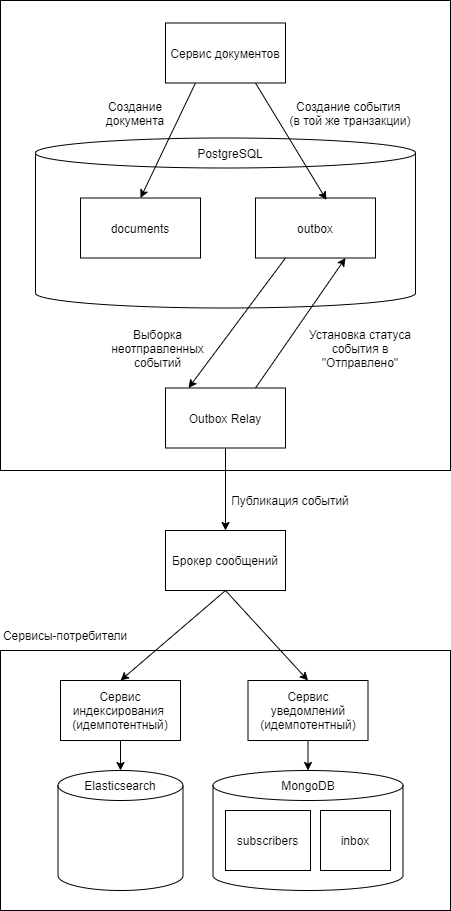

# Задание 2. Согласованность данных между сервисами

## Контекст

В микросервисной архитектуре есть три сервиса, каждый со своей базой данных:

- Сервис документов — хранит метаданные патентов и публикаций (PostgreSQL).

- Сервис индексации — управляет поисковым индексом (OpenSearch/Elasticsearch).

- Сервис уведомлений — отправляет уведомления пользователям о новых документах по подпискам (MongoDB).

## Сценарий

Когда в систему загружается новый документ (патент), должно произойти следующее:
сохранение метаданных в PostgreSQL, индексация в поисковом движке, отправка
уведомлений подписчикам. Все три действия должны быть согласованы: нельзя
отправить уведомление о документе, который не сохранён; нельзя показать в поиске
документ, которого нет в основной базе.

## Что нужно сделать

- Предложить архитектуру взаимодействия сервисов при загрузке документа.
  Объяснить, почему выбран именно такой подход (синхронный, через очередь
  сообщений, сага и т.д.).

- Описать, что произойдёт, если один из сервисов временно недоступен. Как система восстановится?

- Описать механизм, который гарантирует, что уведомление не будет отправлено
  дважды, а документ не будет проиндексирован повторно.

- Привести конкретный пример кода или псевдокода для самого критичного участка
  (на выбор кандидата).

## Что мы оцениваем

Понимание проблем распределённых систем (идемпотентность, согласованность,
отказоустойчивость). Не ожидаем знания конкретных технологий — важен ход мысли.

## Решение

В данной задаче оптимальным является использование паттерна Transactional Outbox + брокер сообщений.

Синхронный подход в данном случае не подходит, так как при этом подходе при загрузке документа мы по цепочке вызываем все три сервиса и ждем ответа от каждого, и если любой из них тормозит или падает, то ломается весь процесс целиком: пользователь не может сохранить патент потому, что, например, сервис уведомлений не отвечает. Время ответа пользователю при этом растет, потому что мы суммируем задержки всех вызовов, хотя пользователю на самом деле не нужно ждать ни индексацию документа, ни отправку уведомлений, а достаточно знать только, что документ сохранен.

Saga в данном случае избыточна. Она применяется, когда шаги распределенного процесса равноправны и сбой на любом из них требует отката предыдущих. В нашем сценарии операции не равноправны: сохранение документа - первичная операция, а индексация и отправка уведомлений - производные. Сбой производной операции не должен приводить к удалению документа из основной базы. Правильная реакция на такой сбой - повторная попытка, которая как раз и обеспечивается паттерном Transactional Outbox.

#### **Плюсы решения**

1. Атомарность. Запись документа и события в outbox-таблицу происходят в одной PostgreSQL-транзакции.

2. Гарантия доставки. Relay-процесс читает события из outbox-таблицы и публикует их в брокер сообщений. Если relay-процесс упадет, то при перезапуске он дообработает неотправленные события. Брокер сообщений гарантирует доставку событий до сервисов индексации и уведомлений в случае их падения, а outbox гарантирует публикацию событий в брокер сообщений в случае его падения.

3. Минимальная связанность сервисов. Сервис документов ничего не знает о потребителях - можно легко добавить новых.

#### **Обеспечение требований задачи**

1. Система обеспечивает strong consistency между таблицей с документами и outbox и eventual consistency между сервисами документов и потребителями - все потребители гарантированно получат событие.

2. Нельзя отправить уведомление о документе, который не сохранен и нельзя показать в поиске документ, которого нет в основной базе: событие появляется только после коммита в PostgreSQL.

#### Что произойдет, если один из сервисов временно недоступен

1. **Сервис документов недоступен.** 
   
   API возвращает ошибку клиенту, никакие события не публикуются и система остается консистентной.

2. **Relay процесс падает во время работы, не успев зафиксировать обработку событий в outbox-таблице (например, между публикацией в брокер и коммитом транзакции).**
   
   После восстановления процесс заново прочитает эти события и повторно опубликует их в брокер сообщений. Это гарантирует нам at-least-once delivery. Но идемпотентность на стороне консьюмеров гарантирует, что события не будут обработаны ими дважды.

3. **Брокер сообщений недоступен.** 
   
   Документы продолжают сохраняться в основную базу данных PostgreSQL, события записываются в outbox-таблицу. Когда брокер восстановится, relay-процесс опубликует накопившиеся события. 

4. **Сервис индексации недоступен.**
   
   События создания документов находятся в брокере сообщений, как только сервис индексации поднимется, то он прочитает эти события и проиндексирует документы. В это время документы уже находятся в основной БД и доступны по прямому запросу (то, что они не находятся через поиск - допустимая деградация).

5. **Сервис уведомлений недоступен.**
   
   Аналогично предыдущему пункту - события копятся в брокере сообщений и после восстановления сервиса они будут им получены и обработаны. 

#### Идемпотентность (защита от дублей)

1. Операция PUT /index/_doc/{id} в Elasticsearch идемпотентна, поэтому в сервисе индексации используем document_id в качестве _id документа в индексе. 

2. Сервис уведомлений использует коллекцию processed_events в MongoDB для защиты от повторной обработки.
   
   При получении события из брокера сервис проверяет, существует ли в коллекции запись с таким event_id. Если существует, то событие уже обработано, и сервис его пропускает.
   
   Если событие новое, сервис определяет список подписчиков, которым нужно отправить уведомления, затем включает его в документ факта обработки события и сохраняет в коллекцию processed_events.
   
   Эта операция атомарна, так как запись факта обработки и список уведомлений к отправке хранятся в одном документе.
   
   Отдельный воркер выбирает из коллекции документы, содержащие уведомления со статусом pending, отправляет их и обновляет статус на sent.
   
   Для защиты от дублей на уровне провайдера рассылки используется ключ идемпотентности (например, hash(event_id + subscriber_id)). Если провайдер не поддерживает ключи идемпотентности, то есть вероятность повторной отправки уведомлений.

Консьюмеры выполняют commit offset (если мы используем Kafka) только после успешной обработки события. Если консьюмер упал после обработки, но до коммита, то событие будет прочитано повторно, но благодаря идемпотентности оно не будет обработано дважды.

### Примечания

1. При выборке неопубликованных событий используем SELECT FOR UPDATE SKIP LOCKED для блокировки выбранных строк на время транзакции и пропуска строк, которые уже заблокированы другими транзакциями. Это позволяет нескольким relay процессам работать параллельно и безопасно, не выбирая одни и те же строки.

2. Если в качестве брокера сообщений используется Kafka и в системе сущестуют события нескольких типов, то используем document_id  в качестве ключа партиционирования для гарантии порядка публикации событий, связанных с одним документом. Тогда все события, связанные с одним документом, будут попадать в одну партицию по порядку. Relay-процесс выбирает события из outbox-таблицы, отсортированными по id (в случае, если id - автоинкрементный первичный ключ) или по дополнительному полю sequence_number (если id - uuid).

3. Необходимо периодически удалять старые записи из таблицы outbox_events и коллекции processed_events.

4. Необходимо настроить различные метрики для отслеживания процесса ретрансляции: 
   
   - Средний «возраст» неотправленных событий (как долго события ожидают отправки).
   
   - Скорость поступления событий (насколько быстро новые события добавляются в outbox).
   
   - Скорость обработки/выгрузки (насколько быстро relay процесс забирает и отправляет события).
   
   - Ошибки внутри процесса ретрансляции.

[Примерный код сервиса обработки документов](DocumentService.php) 

[Примерный код relay процесса](OutboxRelay.php)  (долгоживущий процесс, управляемый через supervisor или systemd)

[Примерный код обработчика в сервисе уведомлений](NotificationEventHandler.php) (долгоживущий процесс, управляемый через supervisor или systemd)
